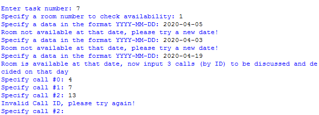

# CMPT-354-Final-Project
<h1>
  Project Overview
</h1>

  In this final project, I worked with two other students to write an embedded SQL interface using Python. 

<h1>  
  Task 2 Steps
 </h1>
 

    1. We have seven different tasks for users to pick
   
   
    2. For each function, we let users to enter different input. However, we need to be able to prevent program from crashing by checking those values.
   
   
    3.The program uses the embedded SQL statement and the input to generate the desired result
   
   
  

  Ex. 
    

  
